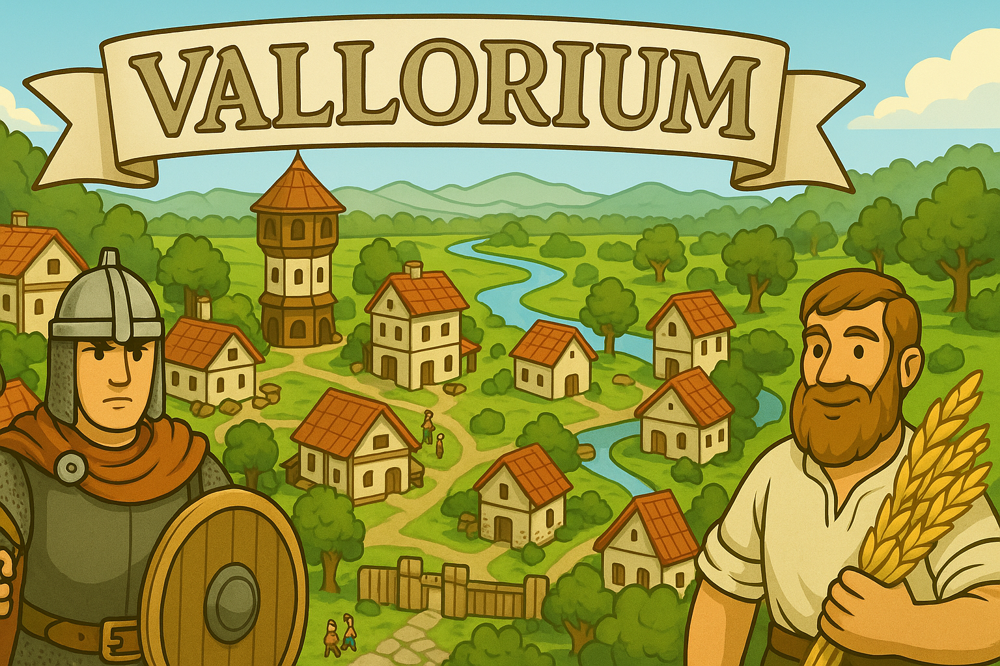

# Vallorium (Inspired by Travian)

**Vallorium** is a persistent, browser-based multiplayer strategy game inspired by [Travian](https://www.travian.com/).

  

## Technologies

- **Backend**: FastAPI
- **Frontend**: Vue 3
- **Database**: PostgreSQL (with plans to adopt PostGIS for geospatial support)
- **Infrastructure as Code**: Terraform

The backend follows a modular FastAPI architecture (based on the [Buutu FastAPI-React cookiecutter template](https://github.com/Buuntu/fastapi-react)) . Since many of the game mechanics are map and distance-based (e.g., villages and fields), I may migrate to **PostGIS** in a future version to better support geospatial queries.

Although I don't have frontend expertise, I chose **Vue 3** for its approachability, even if the community is smaller compared to React.

## Hosting

The project is hosted on **Google Cloud Platform**:

- The frontend (Vue 3 app) is served from a **GCS bucket** (static hosting).
- The backend (FastAPI API) runs on **Cloud Run** or **Compute Engine**.
- The PostgreSQL database is also hosted on **Compute Engine**.
